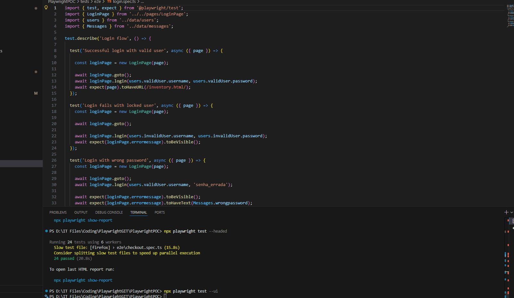

# PlaywrightPOC

## Overview

This repository contains a Proof of Concept (POC) demonstrating
end-to-end test automation using Playwright. The project focuses on
reliable browser automation, structured test design, and maintainable
practices that can scale and integrate with CI/CD pipelines.



## Key Features

-   End-to-end UI test automation with Playwright
-   Cross-browser execution (Chromium, Firefox, WebKit)
-   Page Object Model (POM) style structure (if applicable)
-   Reusable selectors and helper utilities
-   Clear test execution commands for local runs and CI

## Tech Stack

-   Playwright
-   Node.js
-   TypeScript


## Getting Started

### Prerequisites

-   Node.js (LTS recommended)
-   npm (bundled with Node.js)

### Install

``` bash
git clone https://github.com/WillyPess/PlaywrightPOC.git
cd PlaywrightPOC
npm install
```

## Running Tests

### Run all tests

``` bash
npx playwright test
```

### Run tests with the browser visible (headed)

``` bash
npx playwright test --headed
```

### Run in debug mode

``` bash
npx playwright test --debug
```

### Run a specific test file

Replace the path below with your real spec file path.

``` bash
npx playwright test tests/example.spec.js
```

## Reports

Playwright generates test reports after execution. If HTML reporting is
enabled, you can open it with:

``` bash
npx playwright show-report
```

## Contact

-   GitHub: https://github.com/WillyPess
-   LinkedIn: https://www.linkedin.com/in/willy-pessoa/
